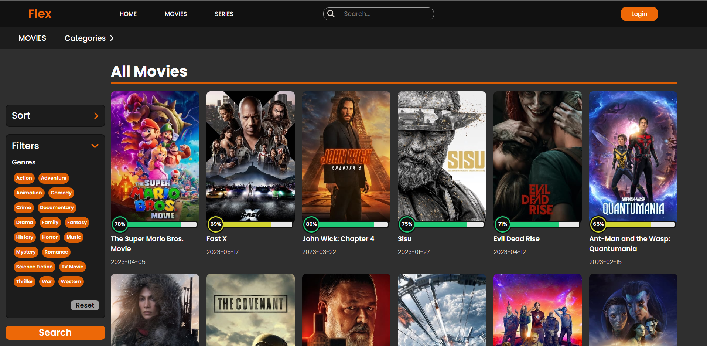

# Flex Movies

Check out the [Movie App web application deployed in Vercel](https://flex-movies.vercel.app/)


## Description

Flex Movies is a web application that allows users to search for information about movies and TV shows. It utilizes The Movie Database (TMDb) API to fetch updated movie data, such as plot details, ratings, cast, and more. Users can perform searches, view movie details, and save their favorite movies.

## Screenshots




## Features

- Search for movies and TV shows by title.
- View movie details, such as plot, rating, cast, genres, trailers, etc.
- Intuitive and user-friendly interface.
- Sort movies and TV shows by popularity, rating, release date, and title.
- Filter movies and TV shows by genres.
- Create an account and log in.
- Save favorite movies.

## Technologies Used

- Sass
- JavaScript
- React.js
- Context
- Axios
- React Router
- The Movie Database (TMDb) API

## Installation

1. Clone this repository to your local machine: 
```
git clone https://github.com/JuanchiiGomezZ/FlexMoviesFrontend
```

2. Navigate to the project directory: ```cd FlexMoviesFrontend```

3. Install the dependencies: ```npm install```

4. Rename the env.template file to .env and make the necessary changes to the environment variables:
```
VITE_API_KEY= Add your TMDb API key
VITE_API_URL= Add your database URL
```

5. Start the application: ```npm run dev```

## Backend & Database
NodeJS, Express, MySQL.
- Authentication and Authorization: The backend provides routes and controllers to handle user authentication and authorization. This includes user registration, user login, and the generation and verification of access tokens to secure access to protected functionalities.
- Movie Management: The backend offers routes and controllers to perform operations related to movies. This can include fetching movie information from a database or an external API, creating new movies, updating existing movie details, and deleting movies.
- Favorites List: The backend allows users to save movies as favorites. This involves implementing routes and controllers to add movies to a user's favorites list, remove movies from the list, and retrieve a user's list of favorite movies.
- Database Interaction: The backend communicates with a database to store and retrieve information about users, movies, and other related data. This involves using technologies like relational or non-relational databases and performing CRUD (Create, Read, Update, Delete) operations to interact with the database.

Features:

- Sign up (POST)
- Login (POST)
- Get user data (GET)
- Get user favorites (GET)
- Add favorite (POST)
- Remove favorite (DELETE)

[Database repository](https://github.com/JuanchiiGomezZ/FlexMoviesBackend)

## Copyright

Project created by Juan Manuel Gomez Omil  
[Linkedin](https://www.linkedin.com/in/juan-manuel-gomez-omil/)

[The Movie Database (TMDb) API](https://www.themoviedb.org/?language=es)
